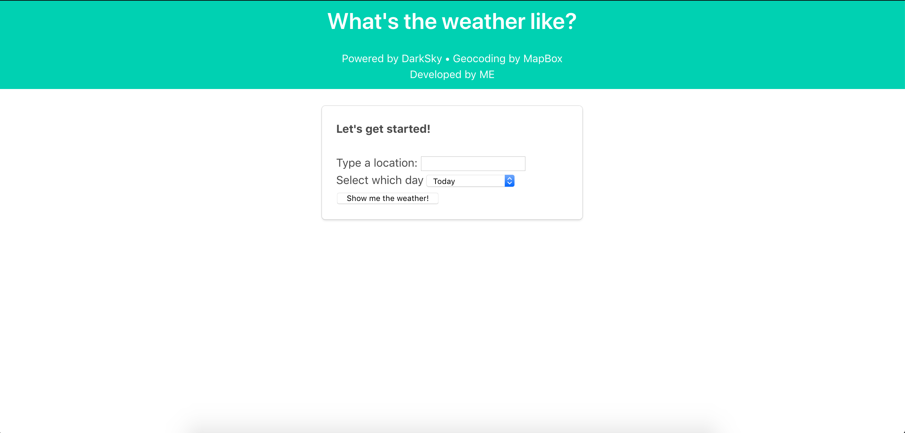

# Weather App using APIs

This is the first web application that I have ever created using APIs. This is also the first README file I have ever written. Please be nice.

## Installation
I used the package manager [pip](https://pypi.org/project/pip/) to install Django.

```bash
pip install Django==2.2.4

```
## Getting started
To get started, clone or download all the files in the respository to the same directory. Then, open that directory in Terminal and run the command `python manage.py runserver`. Enter **localhost:8000** into the url bar and you should get directed to the home page which looks like this:



You are free to check the weather in any location around the world!<sup>[1](#footnote1),</sup><sup>[2](#footnote2)</sup>

#### Notes
<a name="footnote1">1</a>: To actually search up a location on the app, you need to first create a [pickled](https://docs.python.org/3.7/library/pickle.html) text file called *keys.txt* within the *weather_app* directory where the text file contains a dictionary named *keys* with keys *mapbox_key* and *dark_key* that correspond to a user's keys given when signing up on the respective websites. For clarification, *samplekeys.txt* shows how the data should be laid out pre-pickling. For security purposes, I did not include my keys text file in this respository.

<a name="footnote2">2</a>: The location search does not have recommendations as of 9/4/19 but instead searches for the best match given the location input. To ensure searching the correct location, try to be as specific as possible in your search. For example, to search for Athens, Greece instead of Athens, Georgia, typing 'Athens, Greece' rather than just 'Athens' will do that.

#### Resources
Weather API was gathered from [Dark Sky](https://darksky.net/) and map geocoding was done using API from [Mapbox](https://www.mapbox.com/).

Also, a huge thanks to Anthony at [Pretty Printed](https://www.youtube.com/watch?v=v7xjdXWZafY) for helping me get started with this app. CSS used in the app can be seen [here](https://cdnjs.cloudflare.com/ajax/libs/bulma/0.6.2/css/bulma.css).
___
If you encounter any errors in the application and/or code, or want to make any questions or comments, please contact me at kc693@cornell.edu and I will try my best to address it right away!
